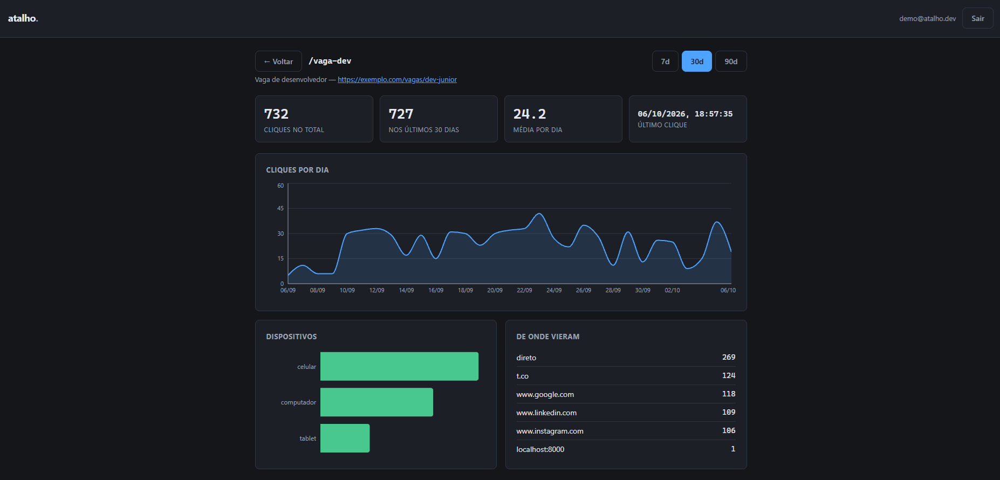

# Atalho

Encurtador de links com painel de analytics. O redirecionamento
sai do cache e responde sem tocar no banco; o clique vai para uma
fila e é gravado por um worker separado, em lote.

`Node 22` · `React 18` · `PostgreSQL 16` · `Redis 7` · `BullMQ` · `Docker Compose` · `86 testes (30 unidade + 56 integração)`



## O que é

Você cola uma URL comprida, recebe `atalho/aB3xY9k`, e o painel
mostra quantos cliques ela teve por dia, de que tipo de
dispositivo e vindos de onde.

Não é um produto — é um projeto de estudo sobre as três peças que
todo serviço com tráfego real acaba precisando: **cache** na
frente do banco, **fila** para tirar trabalho do caminho crítico
e **autenticação** com sessão de verdade. O encurtador é a
desculpa: ele tem a característica que torna essas peças
necessárias, que é ser lido milhares de vezes para cada escrita.

## Arquitetura

```
              ┌──────────── caminho do clique (rápido) ────────────┐

  navegador ──> GET /aB3xY9k ──> Redis (cache) ──> 302 Location
                     │                │
                     │                └── não tem? Postgres, e cacheia
                     │
                     └── evento ──> fila BullMQ (Redis)
                                          │
                                          v
                                    worker (processo separado)
                                          │
                                    lote de 100 (ou 2s)
                                          v
                                    Postgres: INSERT único

              ┌──────────── painel (não precisa ser rápido) ───────┐

  React :5174 ──> API Express :3002 ──> Postgres
                        │
                        └── sessão e rate limit no Redis
```

O redirecionamento nunca escreve no Postgres. É isso que permite
um link que viralizou continuar respondendo no mesmo tempo de
antes: o pico vai para a fila, e o worker grava no ritmo que o
banco aguenta.

## Como rodar

Precisa de Node 22+ e Docker.

```bash
docker compose up -d          # Postgres, Redis e Adminer
cd api
cp .env.example .env
npm install
npm run migrar                # cria as tabelas
npm run semear                # dados de demonstração (opcional)
npm run dev                   # API + redirecionador, :3002
```

Em outro terminal, o worker — sem ele o sistema redireciona
normalmente, mas nenhum clique aparece no painel:

```bash
cd api && npm run worker
```

E o painel:

```bash
cd web && npm install && npm run dev    # :5174
```

Se rodou o `npm run semear`, entre com **demo@atalho.dev** /
**demo12345**.

## Decisões

**Por que o clique não é gravado na hora.** O redirecionamento é
a única parte do sistema que alguém espera de verdade. Um INSERT
ali coloca o Postgres no caminho crítico de todo acesso: o pico
de um link que viralizou vira lentidão para quem clicou, e um
banco fora do ar vira erro na cara da pessoa. Com a fila, o
evento é aceito em microssegundos e o worker grava depois, em
lote — 500 cliques viram um INSERT em vez de 500.

**Por que BullMQ e não uma fila escrita à mão.** O `push`/`pop` é
a parte fácil. O que custa é tentar de novo com espera crescente,
recuperar o job que o worker pegou e não terminou, e ter onde
olhar o que falhou. Isso já existe, funciona e é o que se usa no
mercado.

**Por que sessão em Redis e não JWT.** Um JWT é auto-suficiente:
o servidor confere a assinatura e acredita. A consequência é que
não dá para invalidar um antes de expirar — nem no logout, nem ao
trocar a senha, nem ao banir uma conta. Resolver isso exige uma
lista de bloqueio no servidor, que é justamente o estado que o
JWT prometia evitar. Aqui o cookie carrega um token opaco e
apagar a chave no Redis encerra a sessão na hora, por menos de um
milissegundo por requisição.

**Por que migrações e não um `schema.sql`.** Com schema único, um
banco que já existe nunca recebe as mudanças novas — você acaba
aplicando `ALTER TABLE` na mão e torcendo para não esquecer
nenhum ambiente. Cada migração aqui roda dentro de uma transação
(falhou no meio, desfaz tudo) e sob um `pg_advisory_lock`, para
duas instâncias subindo juntas no deploy não migrarem ao mesmo
tempo.

**Por que 302 e não 301.** O 301 é permanente: o navegador guarda
e nunca mais passa pelo servidor. A estatística pararia de contar
e editar o destino do link deixaria de ter efeito para quem já
clicou uma vez.

**Por que o alfabeto do código não tem `0`, `O`, `1`, `l` nem `I`.**
São os pares que as pessoas erram ao copiar de um slide ou de um
papel. Perder cinco caracteres ainda deixa 57⁷ ≈ 1,9 quatrilhões
de combinações.

**O que é guardado de quem clica.** Dispositivo, navegador,
sistema e o **host** do Referer — `google.com`, não a URL inteira,
que costuma carregar dado pessoal em query string. Nenhum IP,
nenhum cookie no visitante.

## Testes

```bash
cd api
npm test                 # unidade, não precisa de banco

docker compose --profile teste up -d db-teste redis-teste
npm run test:integracao  # contra Postgres e Redis de verdade
```

Os de integração sobem o Express numa porta aleatória e falam com
ele por HTTP — passam por middleware, cookie, SQL e Redis, em vez
de chamar as funções por dentro. O banco de teste nasce vazio a
cada restart do container e são os próprios testes que aplicam as
migrações, o que prova, toda execução, que elas rodam do zero.

O caminho completo `redirecionamento → fila → worker → Postgres`
tem teste próprio, com o worker de verdade ligado.

## API

Tudo abaixo de `/api` exige o cookie de sessão.

| Método | Rota | O que faz |
|---|---|---|
| `POST` | `/api/usuarios` | Cria a conta e já deixa logado |
| `GET` | `/api/usuarios/eu` | Quem está logado |
| `POST` | `/api/sessoes` | Login |
| `DELETE` | `/api/sessoes` | Logout (encerra a sessão no servidor) |
| `GET` | `/api/links` | Lista os links com o total de cliques |
| `POST` | `/api/links` | Encurta (código opcional) |
| `PATCH` | `/api/links/:id` | Troca destino, título ou pausa |
| `DELETE` | `/api/links/:id` | Apaga o link e os cliques |
| `GET` | `/api/links/:id/estatisticas?dias=30` | Totais, série diária, dispositivos e origens |
| `GET` | `/:codigo` | **Redireciona** (público) |
| `GET` | `/health` | Estado da API, do banco e do Redis |

## Estrutura

```
api/
  db/
    migracoes/      001-usuarios-e-links.sql, 002-cliques.sql
    migrar.js       runner com transação e lock
    pool.js
  src/
    rotas/          usuarios, sessoes, links, estatisticas, redirecionar
    servicos/       cache, fila, sessao, senha, agente
    middlewares/    autenticacao, limite (rate limit)
    util/           codigo, validacao
    server.js       API + redirecionador
    worker.js       consumidor da fila
  tests/            unidade + integracao
web/
  src/componentes/  Entrada, ListaLinks, DetalheLink
```
